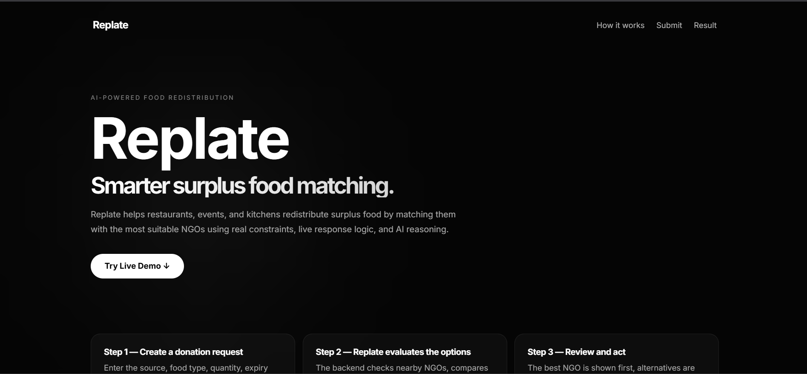
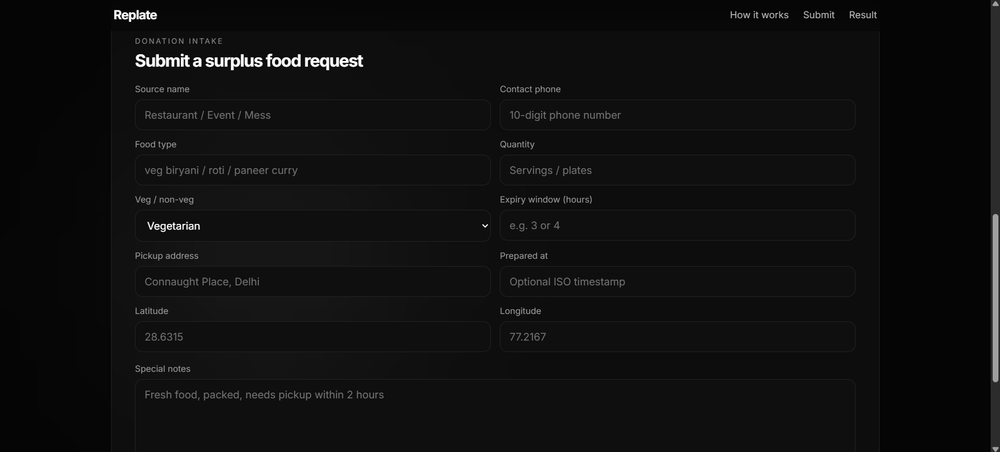
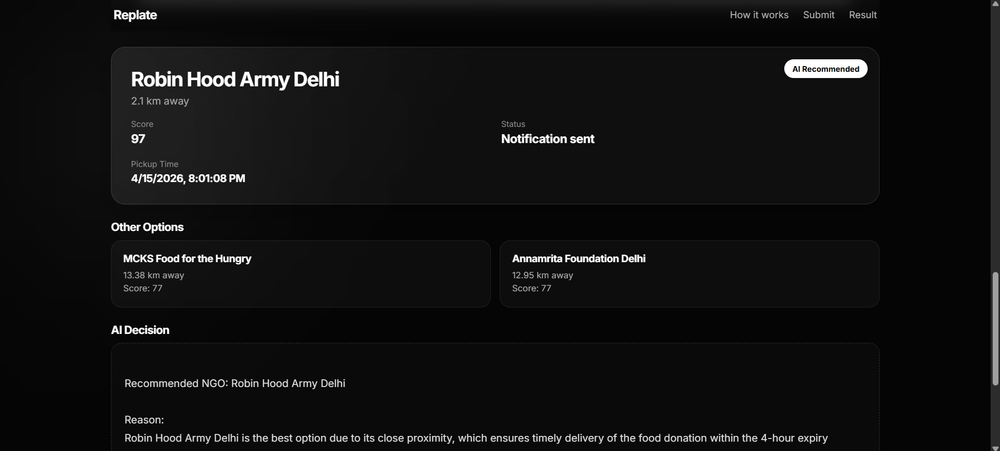

# Replate 🍽️  
### AI-Powered Food Redistribution System

Replate is an intelligent food redistribution platform that connects surplus food sources (restaurants, events, kitchens) with the most suitable NGOs using a **multi-agent AI system**.

It optimizes **distance, capacity, urgency, and reliability** to ensure food reaches those in need efficiently and on time.

---

## 🌐 Repository

👉 https://github.com/rahul-9k/Replate

---

## 🌐 Live Demo

https://replate-frontend-spsl.onrender.com

---

## 📸 Screenshots

### 🔹 Homepage


### 🔹 Donation Form


### 🔹 AI Match Result


---

## 🚀 Features

- 🧠 **AI-powered NGO matching**
- 📊 **Multi-factor scoring system**
  - Distance
  - Capacity
  - Reliability
  - Food compatibility
  - Urgency
- 🔄 **Multi-NGO recommendations**
- 🧾 **AI-generated decision reasoning**
- 🚚 **Pickup planning system**
- 🎯 **Real-world simulation (not a mock demo)**

---

## 🏗️ Architecture

Replate uses a **multi-agent workflow system**:

```text
Donation Input
      ↓
Monitoring Agent
      ↓
Prediction Agent (urgency estimation)
      ↓
Matching Agent (NGO scoring + ranking)
      ↓
Planning Agent (pickup scheduling)
      ↓
Action Agent (final execution)
```

---

## 🛠️ Tech Stack

### Backend
- FastAPI  
- Python  
- LangGraph (agent orchestration)  
- Groq (LLM inference)  

### Frontend
- HTML  
- CSS (custom dark UI)  
- JavaScript (API integration)  

---

## ⚙️ How It Works

1. User submits food donation details  

2. System evaluates:
   - Location  
   - Quantity  
   - Expiry time  

3. NGOs are scored based on:
   - Distance (Haversine)  
   - Capacity availability  
   - Reliability score  
   - Food compatibility  

4. Best NGO is selected  

5. AI generates reasoning + alternatives  

6. Pickup plan is created 

---

## ▶️ Run Locally

### 1. Clone the repository
```bash
git clone https://github.com/rahul-9k/Replate.git
cd Replate
```
### 2. Install dependencies
```bash
pip install -r requirements.txt
```
### 3. Add environment variables

Create a .env file:
GROQ_API_KEY=your_api_key_here

### 4. Run backend
```bash
uvicorn main:app --reload
```

### 5. Run frontend
---

## 🧠 AI Component

Replate is not purely rule-based.

It integrates LLMs to:

- Explain why a particular NGO was selected  
- Compare alternative NGOs  
- Generate human-readable reasoning  

This allows the system to behave more like a decision engine rather than just a scoring script.

---

## 🔮 Future Improvements

- 🗺️ Map visualization (Leaflet / Google Maps)  
- 📱 Mobile-friendly UI  
- 📦 Real NGO API integration  
- 🔔 NGO confirmation system  
- 📊 Analytics dashboard  

---

## 👨‍💻 Author

**Rahul Pandey**

- GitHub: https://github.com/rahul-9k